# Markdown Report Format

The discovery report is a single Markdown file saved to `docs/<feature_name>/discovery.md` in the repo. Markdown keeps the report readable by humans in any editor or on GitHub, and digestible by another LLM with no rendering layer to strip out. All diagrams are Mermaid fenced code blocks — choose the diagram type that fits the structure (see the catalogue below); never hand-roll SVG.

After writing the file, print the absolute path. Offer to open it (`open <path>` on macOS, `xdg-open` on Linux, `start` on Windows) — but the file is meant to be read as text, so the path alone is enough.

## Why Markdown, not HTML

- An LLM ingesting the report reads intent directly — no `<svg>` coordinate noise, no Tailwind class soup.
- A human reads it in their editor, in a PR diff, or rendered on GitHub.
- Diagrams stay as Mermaid source — both human and AI read the same compact, semantic representation.

## Document skeleton

```markdown
# Discovery — {{feature name}}

`{{codebase name}}` · {{DD Mon YYYY}}

| Section | Confidence |
| --- | --- |
| Surfaces | 🟢 High |
| Flows | 🟡 Medium |
| Integrations | 🟢 High |
| Trust boundaries | 🔴 Low |

## System Map

<!-- one Mermaid diagram: the whole system at a glance -->

## Flows

### {{flow name}} — 🟢 High

**Surface:** `src/routes/orders.ts:42`

<!-- one Mermaid sequenceDiagram per flow -->

**Exit:** 201 response to client; `order.created` event on SQS queue.

> **Inference:** validation is synchronous inside OrderHandler — no separate
> service call observed, but the validator module was not fully inspected.

## Integrations

| Integration | Type | Evidence | Confidence |
| --- | --- | --- | --- |
| Postgres | database | `src/db/client.ts:8` | 🟢 High |

## Trust Boundaries

<!-- one block per boundary; a Mermaid flowchart with trust-zone subgraphs works well -->

## Gaps

<!-- ranked list, highest impact × uncertainty first -->
```

## Conventions

**Confidence badges** — emoji + word, used in the summary table, every flow heading, and the integrations table. 🟢 High · 🟡 Medium · 🔴 Low.

**File paths** — always inline code: `` `src/routes/orders.ts:42` ``. They should read as code, not prose.

**Evidence vs inference** — every claim is either evidence (a cited file path) or an inference. Render inferences as a blockquote callout:

```markdown
> **Inference:** the SQS consumer at `order.failed` is the refund trigger —
> derived from the publish in `orders.ts:61`, consumer not yet located.
```

In Mermaid diagrams, mark inferred nodes with a dashed style (see the `classDef` pattern below) so the eye separates confirmed structure from reasoning.

## System Map

One diagram showing the whole system at a glance. Default to a `flowchart LR` with three subgraphs — Surfaces (left), Subsystems (middle), Integrations (right) — and a `classDef` that dashes inferred nodes. If the system is better described another way, pick from the catalogue (e.g. `architecture-beta` for an infra-shaped system, `C4Context` for a service-in-its-environment view).

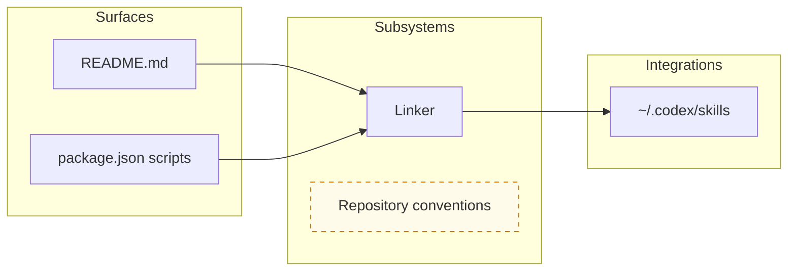

Keep it to one screenful. Short labels in the diagram; full file paths in the evidence text around it. If the graph gets busy, shorten labels and push detail into the flow diagrams below.

## Flows

The heaviest analytical section — flows trace what *happens*, not just what *exists*. One `###` heading per flow, each with a confidence badge, a surface citation, a Mermaid `sequenceDiagram`, a one-line exit, and inference callouts beneath the diagram.

```markdown
### Place order — 🟢 High

**Surface:** `src/routes/orders.ts:42`
```
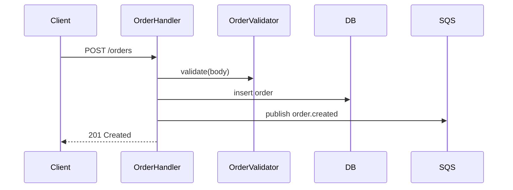

If a flow is a state machine rather than a linear call sequence, use `stateDiagram-v2` instead. If it needs more than ~10 nodes, split it rather than squishing.

## Integrations

A compact table. Columns: Integration | Type | Evidence | Confidence. Types to use, no others: `database`, `queue`, `api`, `auth`, `storage`. If the data model itself is worth showing, add one `erDiagram` below the table.

## Trust Boundaries

One block per boundary — name where it sits, what it guards, and whether that's evidence or inference. A `flowchart` with `subgraph` trust zones makes the boundary visible: nodes inside a zone are trusted, edges crossing a subgraph border are the boundary.

If no trust boundary is found, say so as a high-impact gap — absence is itself a discovery.

## Gaps

Ranked list, highest impact × uncertainty first. Each gap names exactly what is missing — not "X is unclear" but a specific missing piece and what it affects. Prefix with severity: 🔴 high · 🟡 medium · ⚪ low.

```markdown
1. 🔴 **Refund flow not located.** The `order.failed` queue consumer was not
   found — affects trust boundary placement and integration confidence for Stripe.
2. 🟡 **Auth surface not confirmed.** No authentication middleware observed on
   order routes — inferred from absence, not confirmed by reading the chain.
```

When the gap loop resolves a gap, strike it through (`~~...~~`) and add the resolution inline, or move it to a short "Resolved" subsection.

---

# Mermaid diagram catalogue

Mermaid supports many diagram types. The full set is available to you — pick the one that matches the *shape* of what you're describing rather than forcing everything into a flowchart. Validate syntax before writing: quote any label containing spaces, colons, parentheses, or other special characters.

## Pick by need

| You're describing… | Use |
| --- | --- |
| The whole system at a glance | `flowchart` with subgraphs (default), `architecture-beta`, or `C4Context` |
| A request/event travelling through actors over time | `sequenceDiagram` |
| Lifecycle / status transitions of one thing | `stateDiagram-v2` |
| Data model: tables, entities, relationships | `erDiagram` |
| Classes, modules, types and their relations | `classDiagram` |
| Infrastructure: services, DBs, queues, cloud | `architecture-beta` |
| A service in the context of its users & externals | `C4Context` / `C4Container` |
| A user's path through steps, with sentiment | `journey` |
| Schedule, phases, milestones over calendar time | `gantt` |
| Proportions of a whole | `pie` |
| Items scored on two axes (impact × uncertainty for gaps) | `quadrantChart` |
| Requirements traced to what satisfies them | `requirementDiagram` |
| Branch/release history | `gitGraph` |
| Hierarchical brainstorm / decomposition | `mindmap` |
| Events on a chronological line | `timeline` |
| Flow volumes between nodes (data/traffic) | `sankey-beta` |
| Numeric trends — line/bar | `xychart-beta` |
| Fixed-grid layout of blocks | `block-beta` |
| Cards across workflow columns | `kanban` |

## Minimal syntax for the most useful types

**flowchart** — boxes and arrows; supports `subgraph`, `classDef`, edge labels.
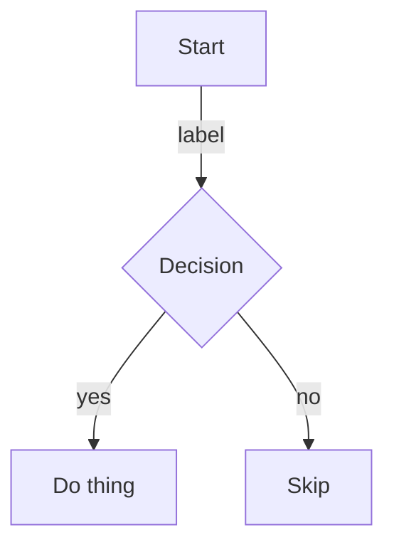

**sequenceDiagram** — actors over time; `->>` call, `-->>` return, `Note`, `alt/opt/loop`.
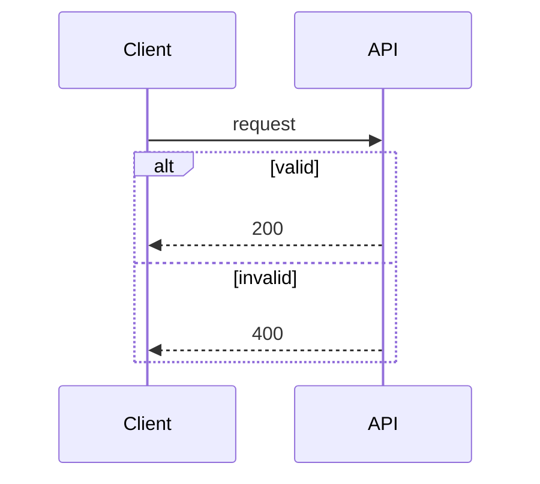

**stateDiagram-v2** — states and transitions; `[*]` is start/end.
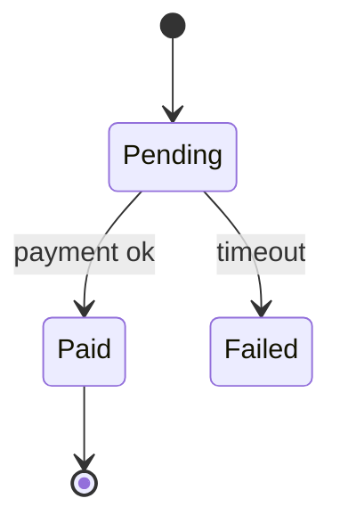

**erDiagram** — entities and cardinality (`||--o{` = one-to-many).
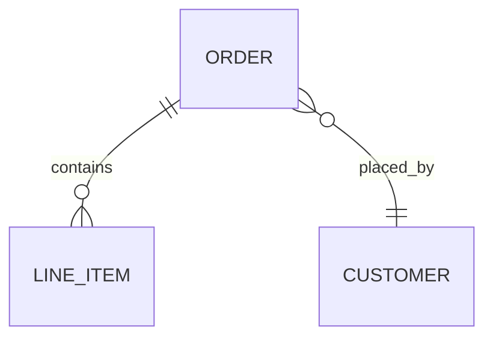

**classDiagram** — types, fields, methods, relationships.
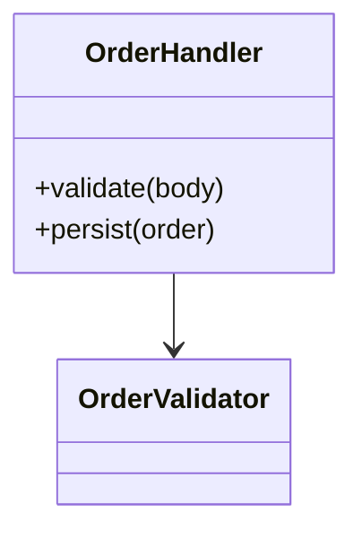

**architecture-beta** — infra groups, services, and edges; good for the system map when the system is infrastructure-shaped.
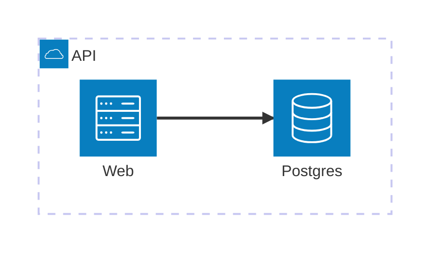

**C4Context** — a system in its environment (people, the system, external systems).
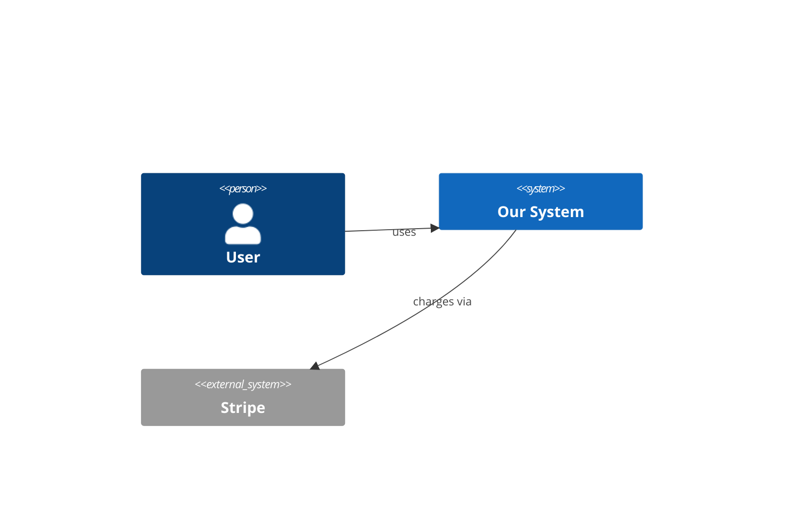

**quadrantChart** — plot items on two axes; ideal for ranking gaps by impact × uncertainty.
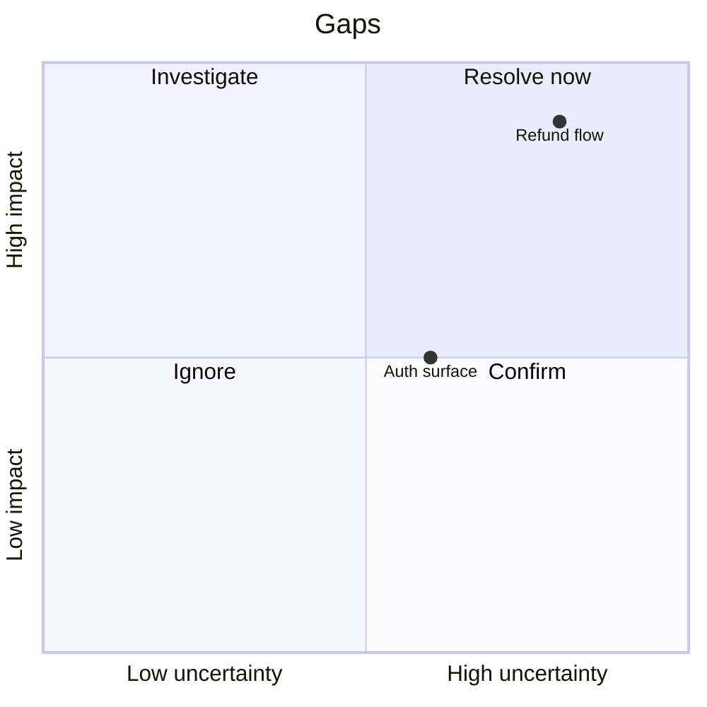

**journey** — steps with a satisfaction score (1–5) and actors.
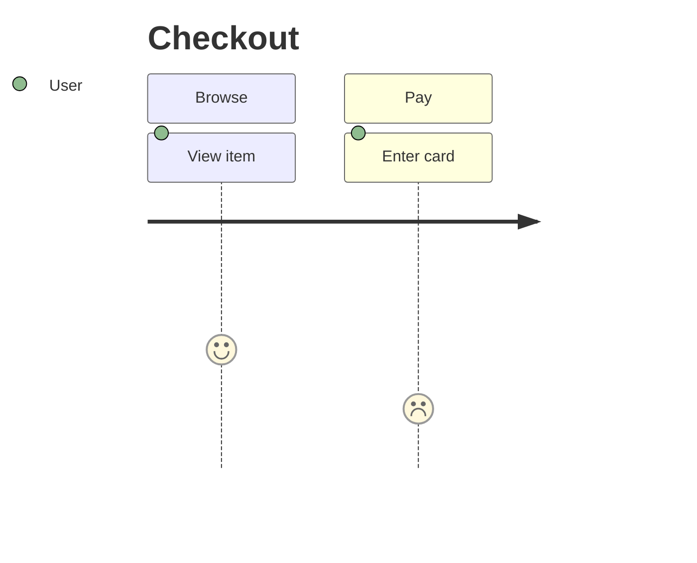

**mindmap** — hierarchical decomposition (e.g. structuring the gap list).
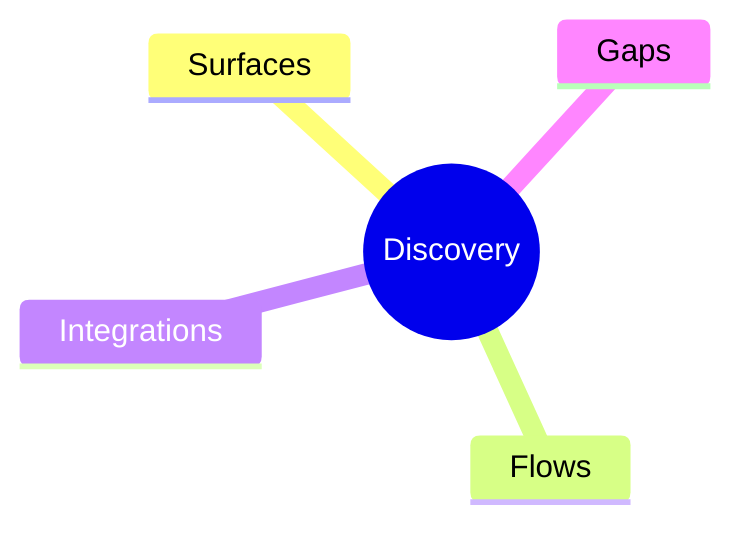

**timeline** — chronological events.
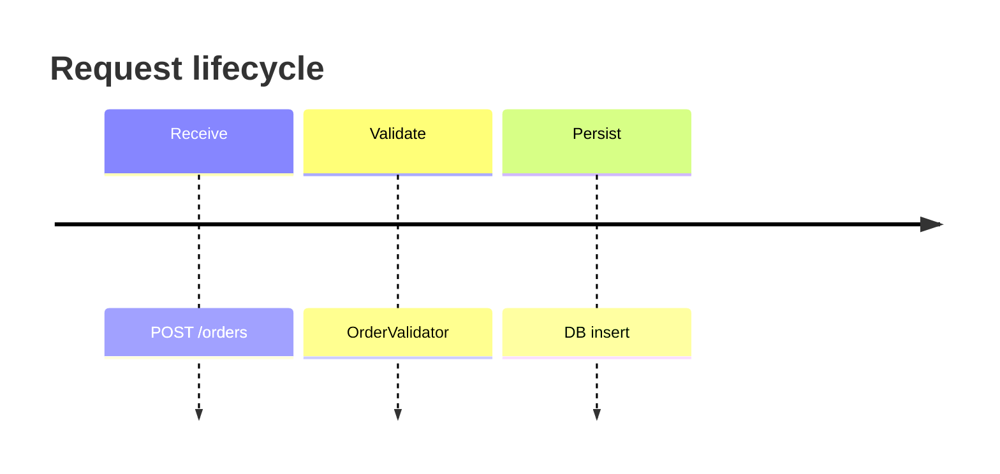

The remaining types — `gantt`, `pie`, `gitGraph`, `requirementDiagram`, `sankey-beta`, `xychart-beta`, `block-beta`, `packet-beta`, `kanban`, `zenuml` — are available too. Reach for them when the data genuinely fits (a schedule, proportions, branch history, byte layout). For a discovery report the workhorses are `flowchart`, `sequenceDiagram`, `stateDiagram-v2`, `erDiagram`, and `quadrantChart`.

## Diagram discipline

- One diagram should make one point. Prefer several small diagrams over one dense one.
- Short labels inside diagrams; file-path evidence in the surrounding prose.
- Mark inferred nodes/edges distinctly (dashed `classDef`, or a `Note` in a sequence).
- If a diagram needs a paragraph of prose to be understood, redraw it.
