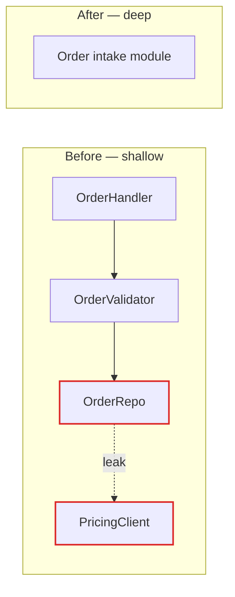

# Markdown Report Format

The swap-in for [HTML-REPORT.md](HTML-REPORT.md). Same deepening candidates, same before/after structure — Markdown instead of a browser, Mermaid instead of hand-built SVG. Reach for it when the report is headed for a PR, a fresh LLM session, or a repo that shouldn't open browsers.

Write a single Markdown file to the OS temp directory — resolve from `$TMPDIR`, falling back to `/tmp` (or `%TEMP%` on Windows) — as `<tmpdir>/architecture-review-<timestamp>.md`, so nothing lands in the repo. After writing, print the absolute path. The file reads as text, so the path alone is enough; offer to open it but don't require it.

## Why Markdown, not HTML

- An LLM ingesting the report reads intent directly — no `<svg>` coordinate noise, no Tailwind class soup.
- A human reads it in their editor, in a PR diff, or rendered on GitHub.
- Diagrams stay as Mermaid source — both human and AI read the same compact, semantic representation.

The cost: no hand-built mass diagrams, cross-sections, or collapse animations. Those become Mermaid graphs (see below). If a candidate genuinely needs an editorial hand-drawn visual to land, that candidate is a reason to use the HTML report instead.

## Document skeleton

```markdown
# Architecture review — {{repo name}}

`{{codebase name}}` · {{DD Mon YYYY}}

| Candidate | Strength |
| --- | --- |
| Collapse the Order intake pipeline | 🟢 Strong |
| Merge the two Pricing adapters | 🟡 Worth exploring |
| Extract a Shipment module | ⚪ Speculative |

## Collapse the Order intake pipeline — 🟢 Strong

**Files:** `src/order/handler.ts` · `src/order/validator.ts` · `src/order/repo.ts`
**Dependency category:** in-process

<!-- before / after: two Mermaid diagrams, or one with a subgraph per side -->

**Problem:** Order intake module is shallow — interface nearly matches the implementation.
**Solution:** Collapse the three wrappers into one intake module; the validator and repo become internals.

**Wins:**
- locality: bugs concentrate in one module
- leverage: one interface, N call sites
- interface shrinks; implementation absorbs the wrappers

> **Contradicts ADR-0007** — but worth reopening because the seam it protects
> never grew the second adapter it anticipated.

## Top recommendation

<!-- one candidate to tackle first, one sentence why, link to its section -->
```

## Conventions

**Strength badges** — emoji + word, used in the summary table and every candidate heading. 🟢 Strong · 🟡 Worth exploring · ⚪ Speculative.

**File paths** — always inline code: `` `src/order/handler.ts` ``. They read as code, not prose.

**Dependency category** — one of `in-process`, `local-substitutable`, `ports & adapters`, `mock`, stated under the files line.

**ADR callout** — when a candidate contradicts an existing ADR and the friction is real enough to reopen it, render a blockquote naming the ADR and why it's worth revisiting. Don't list every refactor an ADR forbids.

## Candidate sections

One `##` per candidate, ordered by strength (the one you'd tackle first at the top of its strength tier). Each has: a strength badge in the heading, the files + dependency category, a before/after Mermaid diagram, a one-line **Problem**, a one-line **Solution**, `Wins` bullets in glossary terms, and — where applicable — the ADR blockquote.

Keep the before/after as two diagrams (or one with a `before`/`after` subgraph). The point is always the same: shallow scatter on the left, one deep module on the right.



Sequence diagrams work well for "before: 6 round-trips; after: 1." State diagrams work for lifecycle-shaped collapses. Pick the diagram that matches the *shape* of the deepening rather than forcing every candidate into a flowchart.

## Top recommendation

One short section at the end: which candidate to tackle first, one sentence on why (usually the strongest candidate with the most locality to gain), and a link to its section.

## Tone

Identical to the HTML report — plain English, concise, architectural nouns and verbs straight from the `/codebase-design` skill.

**Use exactly:** module, interface, implementation, depth, deep, shallow, seam, adapter, leverage, locality.

**Never substitute:** component, service, unit (for module) · API, signature (for interface) · boundary (for seam) · layer, wrapper (for module, when you mean module).

**Wins bullets** name the gain in glossary terms — *"locality: bugs concentrate in one module"*, *"leverage: one interface, N call sites"*, *"interface shrinks; implementation absorbs the wrappers"*. Don't write *"easier to maintain"* or *"cleaner code"* — those terms aren't in the glossary and don't earn their place.

No hedging, no throat-clearing. If a sentence could be a bullet, make it a bullet. If a bullet could be cut, cut it. Quote any Mermaid label containing spaces, colons, or parentheses.
