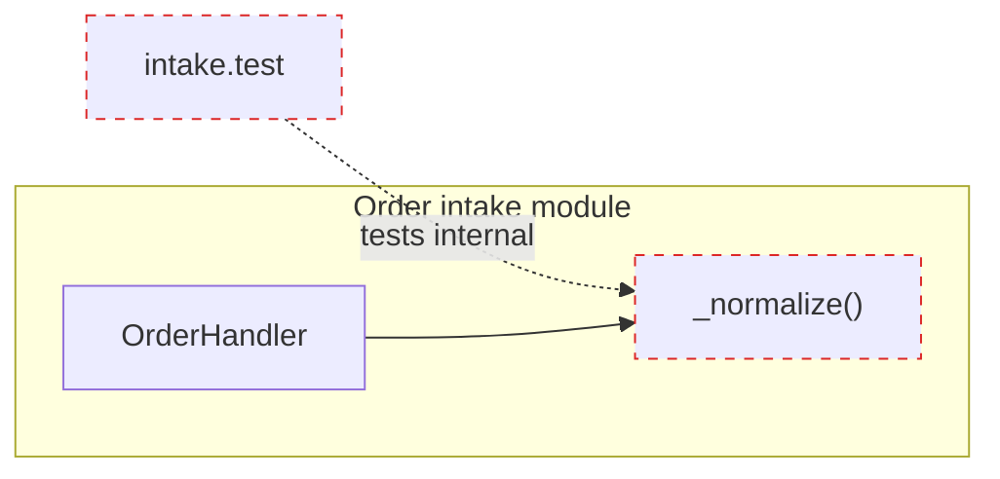

# Markdown Report Format

The swap-in for [HTML-REPORT.md](HTML-REPORT.md). Same content, same **by-seam** organisation — Markdown instead of a browser, Mermaid instead of hand-built SVG. Reach for it when the report is headed for a PR, a fresh LLM session, or a repo that shouldn't open browsers.

Write a single Markdown file to the OS temp directory — resolve from `$TMPDIR`, falling back to `/tmp` (or `%TEMP%` on Windows) — as `<tmpdir>/test-suite-review-<timestamp>.md`, so nothing lands in the repo. After writing, print the absolute path. The file reads as text, so the path alone is enough; offer to open it but don't require it.

## Why Markdown, not HTML

- An LLM ingesting the report reads intent directly — no `<svg>` coordinate noise, no Tailwind class soup.
- A human reads it in their editor, in a PR diff, or rendered on GitHub.
- Diagrams stay as Mermaid source — both human and AI read the same compact, semantic representation.

## Document skeleton

```markdown
# Test-suite review — {{repo name}}

`{{codebase name}}` · {{DD Mon YYYY}}

<!-- Suite health: include ONLY when coverage couldn't run clean. Omit when clean. -->
> **Suite not runnable** — 4 failing tests in `orders.test.ts`. Coverage is
> `n/a`; findings below rest on static seam judgement.

| Seam | State | Coverage |
| --- | --- | --- |
| Order intake | 🔴 Rewrite | 🟡 62% branch |
| Pricing quote | 🟢 Healthy | 🟢 91% |
| Shipment split | 🟣 Fill | 🔴 0% |
| Line normaliser | ⚪ Delete | n/a |

## {{Seam name}} — 🔴 Rewrite

**Module:** `src/order/intake.ts` · **Test:** `test/order/intake.test.ts`

<!-- one Mermaid diagram: where the test sits vs where the seam is -->

**Problem:** test is implementation-coupled — asserts `repo.save` was called, not that the order persisted.
**Action:** rewrite at the intake seam; assert observable order state, drop the mock.

- tests internals, not the interface
- no defence against a real persistence bug

> **Removal justification:** `_normalize()` test is tautological — recomputes the
> normalisation the way the code does. Delete; behaviour is covered at the intake seam.

## Top recommendation

<!-- one seam to act on first, one sentence why, link to its section -->
```

## Conventions

**State badges** — emoji + word, used in the summary table and every seam heading. 🟣 Fill · 🔴 Rewrite · 🔵 Relocate · ⚪ Delete · 🟢 Healthy.

**Coverage badges** — 🟢 high / covered · 🟡 partial · 🔴 none · `n/a` when the suite didn't run. A pointer to a blind spot, never the headline.

**File paths** — always inline code: `` `src/order/intake.ts:42` ``. They read as code, not prose.

**Removal justification** — every `Delete`/`Relocate` seam carries a blockquote naming *why* the test goes (tautological / implementation-coupled / duplicate) and where its coverage lands instead. This line becomes the ticket's justification, so it must stand alone.

## Seam sections

The heaviest section — one `##` per seam, ordered by value (the seam most worth acting on first). Each has: a state badge in the heading, the module + test file paths, one Mermaid diagram, a one-line **Problem**, a one-line **Action**, `Why` bullets in glossary terms, and — for removals — the justification blockquote.

Use the diagram that fits the seam:

- **Test at the wrong seam** — a `flowchart` with the test reaching past the interface into an internal, or the real behaviour sitting one seam up. Dash the wrong-seam edge.
- **Coverage gap** — a `flowchart` of the module's branches with the uncovered path marked; or just state the number if a diagram adds nothing.
- **Relocation** — a `flowchart` lifting the test from the shallow inner module to the caller's seam.



## Suite health

When coverage couldn't run clean, lead with a blockquote (as in the skeleton) before the summary table — red suite, no runner, or flaky. When it ran clean, omit it and go straight to the table.

## Diagram discipline

- One diagram, one point. Prefer several small diagrams over one dense one.
- Short labels inside diagrams; file-path evidence in the surrounding prose.
- Mark the wrong-seam edge / uncovered branch distinctly (dashed or coloured `classDef`).
- If a diagram needs a paragraph of prose to be understood, redraw it.
- Quote any Mermaid label containing spaces, colons, or parentheses.

## Tone

Identical to the HTML report — the nouns and verbs come from `/tdd` and `/codebase-design`.

**Use exactly:** module, interface, implementation, depth, deep, shallow, seam, locality, leverage · good test, behaviour, implementation-coupled, tautological, horizontal-slicing.

**Never substitute:** component, service, unit (for module) · API, signature (for interface) · boundary (for seam) · "brittle"/"fragile" (name the anti-pattern) · "flaky" only for genuine non-determinism.

No hedging, no throat-clearing. If a sentence could be a bullet, make it a bullet. If a bullet could be cut, cut it. If a term isn't in the `/tdd` or `/codebase-design` vocabulary, reach for one that is before inventing a new one.
